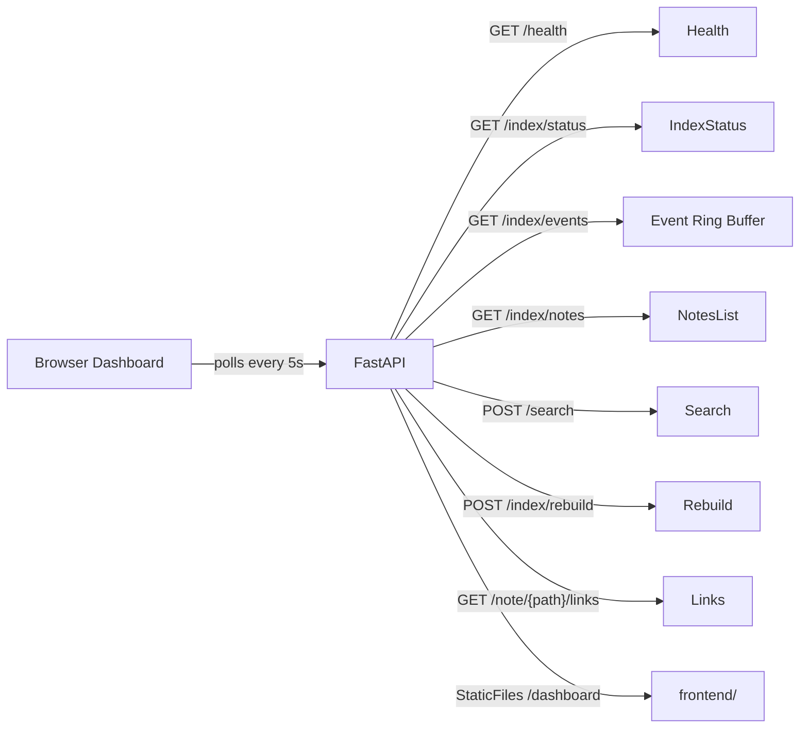
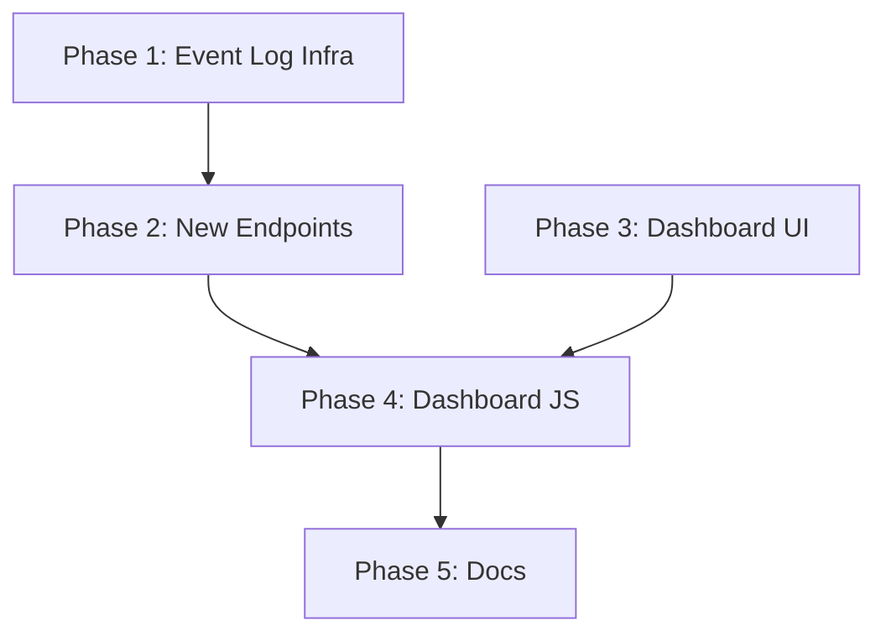

# Monitoring Dashboard for Second Brain Interface

## Architecture Overview

---

## Phase 1: Backend — Event Log Infrastructure

**Goal:** Create the watcher event tracking system and wire it into the existing indexing pipeline.

**Files to touch (4):**

- **Create** `backend/infrastructure/event_log.py`
  - `WatcherEvent` dataclass: `event_type` (created/modified/deleted/moved), `file_path`, `timestamp`, optional `dest_path`
  - `EventLog` class: thread-safe ring buffer (`collections.deque`, maxlen=100), `record(event)` and `get_recent(limit=50)` methods
- **Edit** `backend/domain/models.py` — add response models:
  - `WatcherEventItem(BaseModel)`: event_type, file_path, timestamp, dest_path (optional)
  - `WatcherEventsResponse(BaseModel)`: events list, total count
  - `IndexedNoteItem(BaseModel)`: note_path, note_title
  - `IndexedNotesResponse(BaseModel)`: notes list, total count
- **Edit** `backend/application/index_service.py`:
  - Add `event_log: EventLog` parameter to `__init__`
  - Call `self._event_log.record(...)` in `_on_file_changed`, `_on_file_deleted`, `_on_file_moved`
  - Expose `get_recent_events(limit)` method that delegates to `self._event_log.get_recent(limit)`
- **Edit** `backend/api/dependencies.py`:
  - Create `EventLog` singleton in `initialize_services()`
  - Pass it to `IndexService` constructor

**Key context needed:** `backend/infrastructure/file_watcher.py` (event types), `backend/application/index_service.py` (callback signatures), `backend/api/dependencies.py` (service wiring pattern).

---

## Phase 2: Backend — New API Endpoints

**Goal:** Expose two new GET endpoints for the dashboard to consume.

**Files to touch (2):**

- **Edit** `backend/infrastructure/qdrant_adapter.py`:
  - Add `get_indexed_notes() -> list[dict]` method that scrolls Qdrant with payload `["note_path", "note_title"]` and returns deduplicated `[{note_path, note_title}]`
- **Edit** `backend/api/index_routes.py` — add two routes:
  - `GET /index/events?limit=50` — calls `index_service.get_recent_events(limit)`, returns `WatcherEventsResponse`
  - `GET /index/notes` — calls `qdrant_adapter.get_indexed_notes()` via index_service, returns `IndexedNotesResponse`

**Key context needed:** `backend/api/index_routes.py` (existing route patterns), `backend/domain/models.py` (new response models from Phase 1), `backend/infrastructure/qdrant_adapter.py` (existing `get_indexed_note_paths()` as reference).

---

## Phase 3: Dashboard UI — Static Serving + HTML + CSS

**Goal:** Set up static file serving and create the dashboard layout with styling. After this phase, opening `/dashboard` shows a styled page (with placeholder content).

**Files to touch (4):**

- **Edit** `backend/main.py`:
  - Add `from fastapi.staticfiles import StaticFiles`
  - Mount: `app.mount("/dashboard", StaticFiles(directory="frontend", html=True))`
  - Important: mount AFTER all API routers (StaticFiles is a catch-all)
- **Edit** `Dockerfile`:
  - Add `COPY frontend/ frontend/` after the `COPY backend/ backend/` line
- **Create** `frontend/index.html`:
  - HTML shell with 6 panel sections: Health, Index Status, Recent Events, Search Playground, Vault Browser, Quick Actions
  - Links to `style.css` and `app.js`
  - No external CDN dependencies
- **Create** `frontend/style.css`:
  - CSS Grid layout for panels
  - Color-coded status indicators (green/red/yellow)
  - Clean, modern look with system font stack
  - Responsive design
  - Dark color scheme (matches developer tooling aesthetic)

**Key context needed:** `backend/main.py` (router registration order), `Dockerfile` (COPY order).

---

## Phase 4: Dashboard Logic — JavaScript

**Goal:** Make the dashboard fully interactive by polling API endpoints and updating the DOM.

**Design decision — Relative URLs:** All fetch calls use relative paths (e.g., `fetch('/health')`, `fetch('/index/status')`). Since the dashboard is served from the same FastAPI backend, this automatically works on whatever port the user configured via `SBI_API_PORT`. No hardcoded `localhost:8000` anywhere in the JS.

**Files to touch (1):**

- **Create** `frontend/app.js` — all dashboard logic in one file, organized by panel:
  - **Health panel:** Poll `GET /health` + `GET /index/status` every 5s, show green/red badges for backend, Qdrant, watcher
  - **Index Status panel:** Poll `GET /index/status` every 5s, display note count, chunk count, last indexed time
  - **Recent Events panel:** Poll `GET /index/events?limit=20` every 5s, render as a scrollable list with event type icons and relative timestamps
  - **Search Playground:** Text input + top_k slider + search button, calls `POST /search`, renders results with scores and content snippets
  - **Vault Browser:** Fetch `GET /index/notes` on load, render as a filterable list, click a note to show links via `GET /note/{path}/links`
  - **Rebuild Action:** Button calls `POST /index/rebuild`, shows loading state, displays result (notes/chunks/time)

**Key context needed:** `frontend/index.html` (DOM element IDs from Phase 3), the API response shapes from `backend/domain/models.py`.

---

## Phase 5: Documentation Updates

**Goal:** Keep docs in sync with the new feature and endpoints.

**Files to touch (3):**

- **Edit** `README.md`:
  - Add "Dashboard" section under features: URL (`http://localhost:8000/dashboard`), what it shows
  - Add new endpoints to API reference table
- **Edit** `docs/agents/SKILL.md`:
  - Add `GET /index/events` and `GET /index/notes` to the endpoint table with request/response examples
- **Edit** `CLAUDE.md`:
  - Mention dashboard in project description
  - Update tech stack if needed (note: fix Elasticsearch -> Qdrant while we're there)

**Key context needed:** Current `README.md`, `docs/agents/SKILL.md`, `CLAUDE.md` contents.

---

## Phase Dependency Graph

Phase 1 and Phase 3 are independent and could be done in either order. Phase 2 depends on Phase 1. Phase 4 depends on both Phase 2 and Phase 3. Phase 5 comes last.