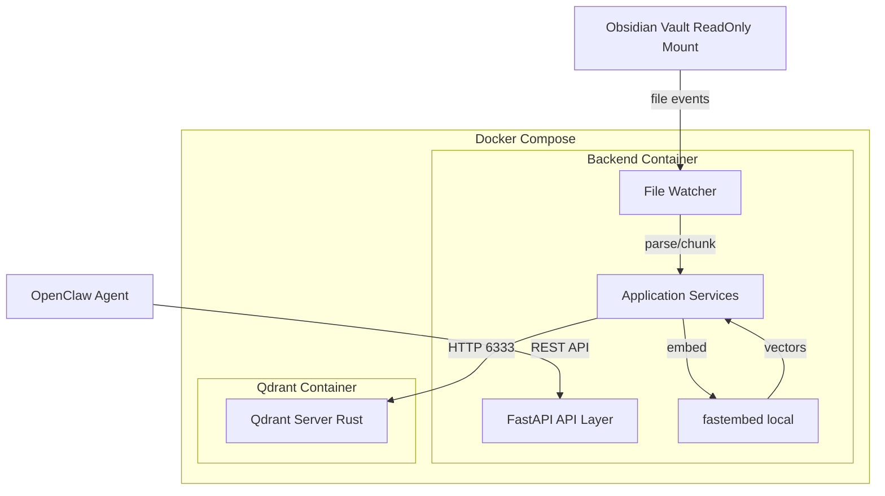
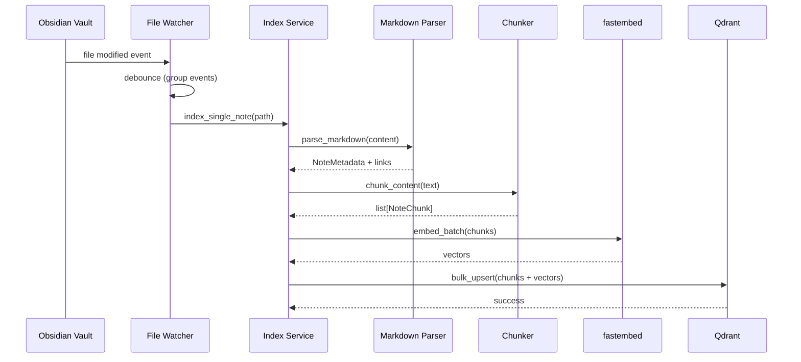
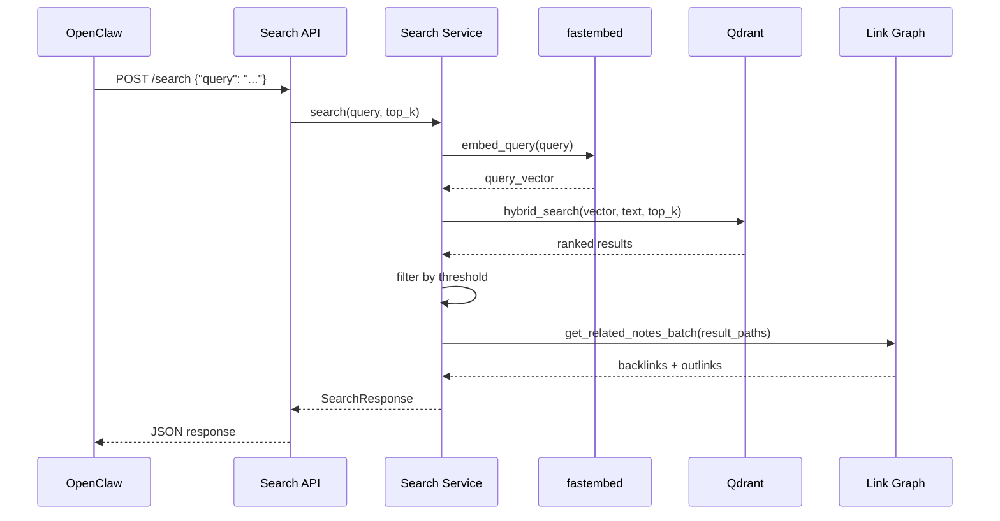

# Design Document: OpenClaw-Obsidian Knowledge Bridge

**Version:** 2.0  
**Status:** Revised - Ready for Implementation  
**Author:** AI Architect  
**Last Updated:** 2026-02-15

**Revision Summary**: Major architecture update based on feedback - switched from Elasticsearch to Qdrant for resource efficiency, added file rename handling, wikilink path resolution via VaultFileMap, hierarchical heading context, N+1 query optimization, and performance testing infrastructure.

---

## Table of Contents

1. [Architecture Overview](#1-architecture-overview)
2. [Data Models (Domain Layer)](#2-data-models-domain-layer)
3. [Component Design](#3-component-design)
4. [API Contract](#4-api-contract)
5. [Qdrant Index Design](#5-qdrant-index-design)
6. [Phased Implementation Plan](#6-phased-implementation-plan)

---

## 1. Architecture Overview

### 1.1 System Context

The Knowledge Bridge is a local middleware service that sits between OpenClaw (AI Agent) and the user's Obsidian vault, providing semantic search and retrieval capabilities.



**Key Principles:**
- **Local First**: All data processing happens on the user's machine. No external API calls.
- **Read-Only Vault**: The middleware never modifies Obsidian notes.
- **Real-Time Sync**: Index updates within 5 seconds of file changes.
- **Hybrid Search**: Combines semantic (vector) and keyword (BM25) search for best results.

### 1.2 Technology Stack

| Layer | Technology | Purpose |
|-------|-----------|---------|
| **Backend** | FastAPI (Python 3.12+) | REST API server |
| **Vector Store** | Qdrant (server mode) | Unified vector + keyword + hybrid search |
| **Embedding** | fastembed (`all-MiniLM-L6-v2`) | Local text-to-vector conversion (384 dims) |
| **File Watcher** | watchdog | Real-time vault monitoring |
| **Container** | Docker Compose | Multi-container orchestration (backend + Qdrant) |
| **Testing** | pytest | Unit and integration tests |
| **Linting** | ruff | Code formatting and linting |

**Why Qdrant?** Qdrant is Rust-based and consumes <50MB RAM idle (vs Elasticsearch 1GB+), includes a built-in dashboard for debugging, and natively supports hybrid search with sparse + dense vectors. Perfect for a local-first tool running alongside your IDE and agent.

### 1.3 Clean Architecture Layers

The project follows Clean Architecture with strict layer dependencies:

```
┌─────────────────────────────────────────┐
│          api/ (FastAPI Routes)          │  ← HTTP handlers, thin controllers
├─────────────────────────────────────────┤
│      application/ (Services)            │  ← Use-case orchestration
├─────────────────────────────────────────┤
│     infrastructure/ (Adapters)          │  ← External system adapters
├─────────────────────────────────────────┤
│        domain/ (Entities)               │  ← Pure business logic, no dependencies
└─────────────────────────────────────────┘
```

**Dependency Rule**: Inner layers never depend on outer layers. `domain/` has zero external dependencies.

### 1.4 Data Flow: Indexing Pipeline



### 1.5 Data Flow: Retrieval Pipeline



---

## 2. Data Models (Domain Layer)

All domain models live in `backend/domain/` and use Pydantic for validation.

### 2.1 Core Entities

#### `NoteMetadata`
```python
class NoteMetadata(BaseModel):
    """Metadata extracted from an Obsidian note."""
    file_path: str  # Relative path from vault root, e.g., "projects/2025-db-migration.md"
    title: str  # Extracted from frontmatter or filename
    last_modified: datetime  # File modification timestamp
    frontmatter: dict[str, Any]  # Parsed YAML frontmatter
    tags: list[str] = []  # Extracted from frontmatter or #tags
    word_count: int  # Total words in the note
```

#### `NoteChunk`
```python
class NoteChunk(BaseModel):
    """A segment of a note for indexing."""
    chunk_id: str  # Format: "{file_path}#chunk{index}", e.g., "notes/foo.md#chunk0"
    note_path: str  # Parent note file path
    content: str  # Actual text content of the chunk
    chunk_index: int  # Position in the note (0-indexed)
    heading_context: str | None  # Full heading hierarchy, e.g., "Database Migration > Planning Phase > Risk Assessment"
    embedding: list[float] | None = None  # 384-dim vector (optional for domain model)
```

#### `WikiLink`
```python
class WikiLink(BaseModel):
    """A wikilink relationship between two notes."""
    source_path: str  # The note containing the link
    link_text: str  # Raw text from [[...]], e.g., "architecture" from [[architecture]]
    resolved_target_path: str | None  # Actual file path after resolution, e.g., "concepts/architecture.md"
    link_type: str = "wikilink"  # Future: "embed", "tag", etc.
```

**Note on Link Resolution**: Obsidian resolves `[[Link]]` intelligently across the entire vault. The `resolved_target_path` is determined by the `VaultFileMap` component which maintains a filename-to-path mapping.

### 2.2 Search Models

#### `SearchRequest`
```python
class SearchRequest(BaseModel):
    """Request body for POST /search."""
    query: str  # Natural language query
    top_k: int = Field(default=5, ge=1, le=20)  # Max results to return
    include_related: bool = True  # Whether to include graph context
    threshold: float | None = None  # Override default similarity threshold
```

#### `SearchResultItem`
```python
class SearchResultItem(BaseModel):
    """A single search result."""
    chunk_id: str
    note_path: str
    note_title: str
    content: str  # The matched chunk content
    score: float  # Relevance score (0-1)
    heading_context: str | None
    highlights: list[str] = []  # Matched keywords (future)
```

#### `RelatedNote`
```python
class RelatedNote(BaseModel):
    """A note related to search results via wikilinks."""
    note_path: str
    note_title: str
    relationship: str  # "backlink" or "outlink"
    link_count: int  # How many search results link to/from this note
```

#### `SearchResponse`
```python
class SearchResponse(BaseModel):
    """Response from POST /search."""
    query: str
    results: list[SearchResultItem]
    related_notes: list[RelatedNote]
    total_hits: int  # Total matches before top_k limit
    search_time_ms: float
```

### 2.3 Supporting Data Structures

#### `VaultFileMap` (Internal)

**Purpose**: Maintains a filename-to-path mapping for intelligent wikilink resolution.

**Structure**:
```python
class VaultFileMap:
    """Maintains a filename -> full_path mapping for wikilink resolution."""
    _map: dict[str, str]  # filename (without .md) -> relative path
    _vault_path: str
    
    def scan(self) -> None:
        """Scan vault directory and build the map."""
    
    def resolve(self, link_text: str) -> str | None:
        """Resolve [[Link]] to actual file path. Returns None if not found."""
    
    def update_file(self, old_path: str | None, new_path: str) -> None:
        """Update map when file is created/moved/renamed."""
```

**Example**:
```python
# Vault structure:
# vault/
#   projects/database-migration.md
#   concepts/architecture.md

vault_map.resolve("architecture")  # Returns "concepts/architecture.md"
vault_map.resolve("database-migration")  # Returns "projects/database-migration.md"
```

### 2.4 Index Status Models

#### `IndexStatus`
```python
class IndexStatus(BaseModel):
    """Response from GET /index/status."""
    indexed_notes: int  # Total notes in index
    indexed_chunks: int  # Total chunks in index
    last_indexed: datetime | None  # Last full index timestamp
    watcher_running: bool
    qdrant_healthy: bool
```

### 2.5 Constants (`backend/domain/constants.py`)

```python
# Chunking
CHUNK_SIZE = 512  # Characters per chunk
CHUNK_OVERLAP = 128  # Overlap between chunks (for context continuity)

# Search
SIMILARITY_THRESHOLD = 0.3  # Min cosine similarity to include in results
TOP_K_DEFAULT = 5  # Default number of results
MAX_TOP_K = 20  # Maximum allowed top_k

# File Watcher
DEBOUNCE_SECONDS = 2.0  # Wait time before triggering index after file change
WATCH_EXTENSIONS = [".md"]  # File types to monitor

# Qdrant
QDRANT_COLLECTION_NAME = "obsidian_chunks"
QDRANT_LINK_COLLECTION_NAME = "obsidian_links"
EMBEDDING_DIM = 384  # Dimension of all-MiniLM-L6-v2
```

---

## 3. Component Design

### 3.1 Infrastructure Layer

#### `MarkdownParser` (`infrastructure/markdown_parser.py`)

**Responsibility**: Parse `.md` files, extract structured data, resolve wikilinks.

**Interface**:
```python
class MarkdownParser:
    def __init__(self, vault_file_map: VaultFileMap):
        self._file_map = vault_file_map
    
    def parse(self, file_path: str, content: str) -> tuple[NoteMetadata, list[WikiLink]]:
        """Parse markdown file and return metadata + extracted links."""
        pass
```

**Key Functions**:
- Strip formatting (bold, italic, code blocks) for clean text
- Extract YAML frontmatter
- Resolve `[[wikilinks]]` using `VaultFileMap` (handles cross-folder links, aliases)
- Extract `#tags` from content

**Dependencies**: `markdown-it-py`, `pyyaml`

#### `Chunker` (`infrastructure/chunker.py`)

**Responsibility**: Split long notes into semantically coherent chunks.

**Interface**:
```python
class Chunker:
    def chunk(self, note_path: str, content: str) -> list[NoteChunk]:
        """Split content into chunks for indexing."""
        pass
```

**Strategy**: Heading-based with fallback to fixed-size
1. Split by markdown headings (`##` level 2 or `###` level 3)
2. If a section exceeds `CHUNK_SIZE`, split with `CHUNK_OVERLAP`
3. Preserve **full heading hierarchy** in each chunk (e.g., "Database Migration > Planning Phase > Risk Assessment")

**Heading Hierarchy Tracking**:
```python
def chunk(self, note_path: str, content: str) -> list[NoteChunk]:
    heading_stack = []  # Track full path: ["Database Migration", "Planning Phase", ...]
    
    for line in content.split('\n'):
        if line.startswith('#'):
            level = len(line.split()[0])  # Count '#' characters
            heading = line.lstrip('#').strip()
            
            # Pop stack to current level
            heading_stack = heading_stack[:level-1]
            heading_stack.append(heading)
        
        # When creating chunk:
        chunk.heading_context = " > ".join(heading_stack)  # Full hierarchy
```

#### Embedding with `fastembed` (`infrastructure/embedding.py`)

**Responsibility**: Convert text to 384-dim vectors using `all-MiniLM-L6-v2`.

**Why fastembed?** Qdrant's `fastembed` library is optimized for the same models as `sentence-transformers` but with better performance and smaller memory footprint.

**Implementation Note**: We create a thin wrapper module (`embedding.py`) to encapsulate `fastembed` usage. This keeps the service layer clean and makes it easier to swap embedding providers later if needed.

**Usage**:
```python
# In infrastructure/embedding.py
from fastembed import TextEmbedding

class EmbeddingService:
    def __init__(self, model_name: str = "sentence-transformers/all-MiniLM-L6-v2"):
        self._model = None
        self._model_name = model_name
    
    def _ensure_loaded(self):
        """Lazy-load the model on first use."""
        if self._model is None:
            self._model = TextEmbedding(model_name=self._model_name)
    
    def embed_text(self, text: str) -> list[float]:
        """Embed a single text string."""
        self._ensure_loaded()
        return list(self._model.embed([text]))[0]
    
    def embed_batch(self, texts: list[str]) -> list[list[float]]:
        """Embed multiple texts efficiently (batched)."""
        self._ensure_loaded()
        return list(self._model.embed(texts))
```

**Usage in Services**:
```python
# In application/index_service.py
from infrastructure.embedding import EmbeddingService

embedder = EmbeddingService()
vectors = embedder.embed_batch([chunk.content for chunk in chunks])
```

#### `VaultFileMap` (`infrastructure/vault_file_map.py`)

**Responsibility**: Maintain a filename-to-path mapping for intelligent wikilink resolution.

**Interface**:
```python
class VaultFileMap:
    def __init__(self, vault_path: str):
        self._vault_path = vault_path
        self._map: dict[str, str] = {}  # filename (no extension) -> relative path
    
    def scan(self) -> None:
        """Walk vault directory and build the map."""
        pass
    
    def resolve(self, link_text: str) -> str | None:
        """Resolve [[Link]] to actual file path. Returns None if not found."""
        pass
    
    def update_file(self, old_path: str | None, new_path: str) -> None:
        """Update map when file is created/moved/renamed."""
        pass
```

**Key Functions**:
- `scan()`: Walk vault on startup, populate `_map` with all `.md` files
- `resolve()`: Look up link text in map (handles case-insensitive matching)
- `update_file()`: Keep map in sync when files are renamed/moved

**Example**:
```python
# Vault: projects/database-migration.md, concepts/architecture.md
vault_map.resolve("architecture")  # Returns "concepts/architecture.md"
```

#### `QdrantAdapter` (`infrastructure/qdrant_adapter.py`)

**Responsibility**: All interactions with Qdrant vector database.

**Interface**:
```python
from qdrant_client import QdrantClient
from qdrant_client.models import Distance, VectorParams, PointStruct

class QdrantAdapter:
    def __init__(self, url: str = "http://localhost:6333"):
        """
        Initialize Qdrant client.
        URL should be configurable via env var (e.g., QDRANT_URL).
        Default localhost for local dev, use "http://qdrant:6333" in Docker.
        """
        self.client = QdrantClient(url=url)
    
    def create_collection(self) -> None:
        """Create obsidian_chunks collection with vector config."""
        pass
    
    def bulk_upsert_chunks(self, chunks: list[NoteChunk]) -> None:
        """Insert or update chunks in bulk."""
        pass
    
    def delete_by_note_path(self, note_path: str) -> None:
        """Remove all chunks for a given note."""
        pass
    
    def vector_search(self, query_vector: list[float], top_k: int) -> list[dict]:
        """Dense vector search (semantic)."""
        pass
    
    def hybrid_search(self, dense_vector: list[float], sparse_vector: dict, top_k: int) -> list[dict]:
        """Hybrid search using RRF (Reciprocal Rank Fusion)."""
        pass
    
    def get_related_notes_batch(self, note_paths: list[str]) -> dict[str, dict]:
        """Fetch backlinks/outlinks for multiple notes in one query (N+1 optimization)."""
        pass
```

**Key Details**:
- Dense vectors: 384 dims, cosine similarity
- Sparse vectors: keyword matching (BM25 equivalent)
- Use Qdrant's native RRF for hybrid search
- Batch queries for link graph traversal (avoid N+1 problem)

#### `FileWatcher` (`infrastructure/file_watcher.py`)

**Responsibility**: Monitor vault directory for `.md` file changes, including renames/moves.

**Interface**:
```python
class FileWatcher:
    def __init__(self, vault_path: str, on_change: Callable[[str, str, str | None], None]):
        """Initialize watcher. on_change(event_type, file_path, old_path)."""
        pass
    
    def start(self) -> None:
        """Start watching."""
        pass
    
    def stop(self) -> None:
        """Stop watching."""
        pass
```

**Implementation**: Use `watchdog.observers.Observer` with a custom event handler. Integrate with `Debouncer` to group rapid events.

**Event Types Handled**:
- `FileCreatedEvent` → trigger `index_single_note(new_path)`
- `FileModifiedEvent` → trigger `index_single_note(path)`
- `FileDeletedEvent` → trigger `delete_note(path)`
- **`FileMovedEvent`** → trigger `rename_note(old_path, new_path)` (critical for Obsidian workflows)

#### `Debouncer` (`infrastructure/debouncer.py`)

**Responsibility**: Prevent over-indexing during rapid file edits (e.g., autosave).

**Interface**:
```python
class Debouncer:
    def __init__(self, delay: float, callback: Callable[[str], None]):
        """Callback is invoked after delay seconds of inactivity."""
        pass
    
    def trigger(self, file_path: str) -> None:
        """Register a file change. Resets the timer."""
        pass
```

**Implementation**: Use threading.Timer. Each `trigger()` cancels the previous timer and starts a new one.

### 3.2 Application Layer

#### `IndexService` (`application/index_service.py`)

**Responsibility**: Orchestrate the indexing pipeline.

**Interface**:
```python
class IndexService:
    def __init__(
        self,
        vault_path: str,
        parser: MarkdownParser,
        chunker: Chunker,
        qdrant_adapter: QdrantAdapter,
        vault_file_map: VaultFileMap
    ):
        self._vault_path = vault_path
        self._file_map = vault_file_map
        # Initialize file map on startup
        self._file_map.scan()
    
    def rebuild_index(self, vault_path: str) -> dict:
        """Full re-index of all .md files in vault."""
        pass
    
    def index_single_note(self, vault_path: str, note_path: str) -> None:
        """Index or update a single note."""
        pass
    
    def delete_note(self, note_path: str) -> None:
        """Remove a note from the index."""
        pass
    
    def rename_note(self, old_path: str, new_path: str) -> None:
        """Handle file rename/move operation."""
        # 1. Delete chunks where note_path == old_path
        # 2. Index file at new_path
        # 3. Update VaultFileMap
        # 4. (Phase 4+) Update link graph
        pass
    
    def get_status(self) -> IndexStatus:
        """Return current index statistics."""
        pass
```

**Workflow (rebuild_index)**:
1. Walk vault directory, collect all `.md` files
2. For each file: parse → chunk → embed → bulk upsert
3. Return summary (files indexed, chunks created, time taken)

**Workflow (index_single_note)**:
1. Read file content
2. Parse → extract metadata + links (with wikilink resolution via VaultFileMap)
3. Chunk content (with full heading hierarchy)
4. Embed chunks using fastembed
5. Delete old chunks for this note (by note_path)
6. Insert new chunks into Qdrant

**Workflow (rename_note)** — New for file rename support:
1. Delete all chunks where `note_path == old_path` from Qdrant
2. Call `index_single_note()` for the file at `new_path`
3. Update `VaultFileMap` to reflect the new path
4. (Phase 4+) Update any links in the link graph that reference the old path

#### `SearchService` (`application/search_service.py`)

**Responsibility**: Orchestrate the search and retrieval pipeline.

**Interface**:
```python
class SearchService:
    def __init__(
        self,
        qdrant_adapter: QdrantAdapter
    ):
        pass
    
    def search(self, request: SearchRequest) -> SearchResponse:
        """Execute search with graph enrichment."""
        pass
```

**Workflow**:
1. Embed the query text using fastembed
2. Execute hybrid search (Qdrant RRF with dense + sparse vectors)
3. Filter results below threshold
4. Limit to top_k
5. If `include_related=True`: extract note paths from results, call `get_related_notes_batch()` (N+1 optimization), build `RelatedNote` list
6. Return `SearchResponse`

### 3.3 API Layer

#### `HealthRouter` (`api/health_routes.py`)

**Endpoints**:
- `GET /health` — Simple health check (returns `{"status": "ok"}`)

#### `IndexRouter` (`api/index_routes.py`)

**Endpoints**:
- `POST /index/rebuild` — Trigger full re-index (returns summary)
- `GET /index/status` — Return index statistics

#### `SearchRouter` (`api/search_routes.py`)

**Endpoints**:
- `POST /search` — Main search endpoint (body: `SearchRequest`, response: `SearchResponse`)

#### `NoteRouter` (`api/note_routes.py`)

**Endpoints**:
- `GET /note/{note_path:path}/links` — Get backlinks and outlinks for a specific note

---

## 4. API Contract

### 4.1 Base URL

Local development: `http://localhost:8000`

### 4.2 Endpoints

#### `GET /health`

**Summary**: Health check endpoint.

**Response**: `200 OK`
```json
{
  "status": "ok",
  "timestamp": "2026-02-15T10:30:00Z"
}
```

---

#### `POST /search`

**Summary**: Semantic + keyword hybrid search over Obsidian vault.

**Request Body**:
```json
{
  "query": "database migration decision",
  "top_k": 5,
  "include_related": true,
  "threshold": null
}
```

**Response**: `200 OK`
```json
{
  "query": "database migration decision",
  "results": [
    {
      "chunk_id": "projects/2025-db-migration.md#chunk0",
      "note_path": "projects/2025-db-migration.md",
      "note_title": "Database Migration 2025",
      "content": "We chose Blue-Green deployment because...",
      "score": 0.87,
      "heading_context": "## Decision",
      "highlights": []
    }
  ],
  "related_notes": [
    {
      "note_path": "meetings/architecture-review-2025.md",
      "note_title": "Architecture Review Meeting",
      "relationship": "backlink",
      "link_count": 2
    }
  ],
  "total_hits": 12,
  "search_time_ms": 45.3
}
```

**Error Responses**:
- `503 Service Unavailable` — Index not ready or Qdrant down
  ```json
  {
    "error_code": "INDEX_NOT_READY",
    "detail": "Index is not ready yet. Please try again later."
  }
  ```

---

#### `GET /index/status`

**Summary**: Get current index health and statistics.

**Response**: `200 OK`
```json
{
  "indexed_notes": 142,
  "indexed_chunks": 1203,
  "last_indexed": "2026-02-15T09:15:00Z",
  "watcher_running": true,
  "qdrant_healthy": true
}
```

---

#### `POST /index/rebuild`

**Summary**: Force a full re-index of the vault (manual trigger).

**Response**: `200 OK`
```json
{
  "status": "success",
  "notes_indexed": 142,
  "chunks_created": 1203,
  "time_taken_seconds": 12.4
}
```

**Error Responses**:
- `409 Conflict` — Re-index already in progress
  ```json
  {
    "error_code": "REINDEX_IN_PROGRESS",
    "detail": "A re-index operation is already running."
  }
  ```

---

#### `GET /note/{note_path:path}/links`

**Summary**: Get backlinks and outgoing links for a specific note.

**Path Parameter**: `note_path` (URL-encoded, e.g., `projects%2F2025-db-migration.md`)

**Response**: `200 OK`
```json
{
  "note_path": "projects/2025-db-migration.md",
  "backlinks": [
    {
      "note_path": "meetings/architecture-review-2025.md",
      "note_title": "Architecture Review Meeting"
    }
  ],
  "outlinks": [
    {
      "note_path": "concepts/blue-green-deployment.md",
      "note_title": "Blue-Green Deployment"
    }
  ]
}
```

**Error Responses**:
- `404 Not Found` — Note does not exist in the index
  ```json
  {
    "error_code": "NOTE_NOT_FOUND",
    "detail": "Note not found in index: projects/2025-db-migration.md"
  }
  ```

---

## 5. Qdrant Index Design

### 5.1 Collection: `obsidian_chunks`

**Purpose**: Store note chunks with dense + sparse vectors for hybrid search.

**Collection Configuration**:
```python
from qdrant_client.models import Distance, VectorParams, SparseVectorParams

client.create_collection(
    collection_name="obsidian_chunks",
    vectors_config={
        "dense": VectorParams(
            size=384,
            distance=Distance.COSINE
        )
    },
    sparse_vectors_config={
        "text": SparseVectorParams()  # For keyword search (BM25 equivalent)
    }
)
```

**Payload Structure** (stored with each point):
```python
{
    "chunk_id": "projects/database-migration.md#chunk0",
    "note_path": "projects/database-migration.md",
    "note_title": "Database Migration 2025",
    "content": "We chose Blue-Green deployment because...",
    "chunk_index": 0,
    "heading_context": "Database Migration > Decision > Deployment Strategy",  # Full hierarchy
    "last_modified": "2026-02-15T10:00:00Z",
    "tags": ["project", "migration", "devops"]
}
```

**Index Strategy**:
- **Dense vectors**: Semantic embeddings from `fastembed` (all-MiniLM-L6-v2, 384 dims)
- **Sparse vectors**: Keyword-based vectors for BM25-style matching
- **Hybrid search**: Qdrant's native RRF (Reciprocal Rank Fusion) combines both automatically

### 5.2 Collection: `obsidian_links`

**Purpose**: Store wikilink relationships for graph traversal.

**Collection Configuration**:
```python
client.create_collection(
    collection_name="obsidian_links",
    vectors_config={}  # No vectors needed, just payload filtering
)
```

**Payload Structure**:
```python
{
    "source_path": "projects/database-migration.md",
    "link_text": "architecture",
    "resolved_target_path": "concepts/architecture.md",
    "link_type": "wikilink"
}
```

**Query Patterns**:
- **Backlinks**: Filter where `resolved_target_path == X`
- **Outlinks**: Filter where `source_path == X`
- **Batch query** (N+1 optimization): Filter where `source_path IN [X, Y, Z]` OR `resolved_target_path IN [X, Y, Z]`

### 5.3 Hybrid Search Implementation

**Query Example**:
```python
from fastembed import TextEmbedding

# Initialize embedder
embedder = TextEmbedding(model_name="sentence-transformers/all-MiniLM-L6-v2")

# Prepare query vectors
query_text = "database migration decision"
dense_vector = list(embedder.embed([query_text]))[0]

# Qdrant hybrid search (RRF)
results = client.search(
    collection_name="obsidian_chunks",
    query_vector=("dense", dense_vector),
    query_filter=None,
    limit=5,
    with_payload=True,
    search_params={
        "fusion": "rrf",  # Reciprocal Rank Fusion
        "rrf_k": 60  # RRF parameter (default)
    }
)
```

**Search Modes**:
1. **Dense-only** (Phase 3): Pure semantic search using dense vectors
2. **Hybrid** (Phase 6): Dense + sparse RRF for best results

### 5.4 Collection Lifecycle

- **Create**: Collections are created on first `POST /index/rebuild` if they don't exist
- **Update**: Points are upserted (by `chunk_id` as point ID) on file changes
- **Delete**: Points are deleted by filtering `note_path` when a file is removed
- **Rename**: Old points deleted by `note_path`, new points inserted with new path

### 5.5 Dashboard Access

Qdrant provides a built-in web UI for debugging and data inspection:
- **URL**: `http://localhost:6333/dashboard`
- **Features**: Browse collections, inspect payloads, test searches, view cluster status

---

## 6. Phased Implementation Plan

Each phase is designed to be **self-contained**, **testable**, and **small in context** (~3-5 files).

---

### Phase 1: Project Foundation

**PRD Coverage**: None (scaffolding)  
**Goal**: Bootable project skeleton with Docker Compose running FastAPI + Qdrant

#### Scope

**Files Created**:
```
backend/
├── domain/
│   ├── __init__.py
│   ├── constants.py
│   └── models.py (NoteChunk, NoteMetadata, WikiLink, SearchRequest, SearchResponse, etc.)
├── application/
│   └── __init__.py
├── infrastructure/
│   └── __init__.py
├── api/
│   ├── __init__.py
│   └── health_routes.py
├── main.py (FastAPI app entry point)
├── logging_config.py
└── __init__.py

tests/
├── conftest.py
└── test_health.py

requirements.txt
Makefile
Dockerfile
docker-compose.yml
.dockerignore
.gitignore
README.md (basic setup instructions)
```

#### Key Deliverables

1. **Project Structure**: Clean Architecture directory layout
2. **Domain Models**: All Pydantic models defined in `domain/models.py`
3. **Constants**: All config values in `domain/constants.py`
4. **Docker Compose**: `backend` + `qdrant` services
5. **Health Endpoint**: `GET /health` returns 200
6. **Makefile Targets**: `make up`, `make down`, `make test`, `make lint`, `make format`
7. **Basic Tests**: `test_health.py` verifies the health endpoint

#### Done Criteria

- `docker compose up` starts both services
- `GET http://localhost:8000/health` returns `{"status": "ok"}`
- Qdrant is reachable from backend at `http://qdrant:6333`
- Qdrant dashboard accessible at `http://localhost:6333/dashboard`
- `make test` passes
- `make lint` passes

#### Dependencies to Install (`requirements.txt`)

```
fastapi==0.109.0
uvicorn[standard]==0.27.0
pydantic==2.5.3
pydantic-settings==2.1.0
qdrant-client==1.7.0
fastembed==0.1.3
watchdog==4.0.0
python-dotenv==1.0.1
pyyaml==6.0.1
markdown-it-py==3.0.0
pytest==8.0.0
pytest-asyncio==0.23.3
httpx==0.26.0
ruff==0.1.14
```

---

### Phase 2: Content Pipeline (Indexing Core)

**PRD Coverage**: IDX-02 (Content Parsing + Chunking)  
**Goal**: Parse Markdown files, chunk them, embed them, store in Qdrant

#### Scope

**Files Created/Modified**:
```
backend/infrastructure/
├── markdown_parser.py
├── chunker.py
├── embedding.py (fastembed usage)
├── qdrant_adapter.py
└── vault_file_map.py (NEW - wikilink resolution)

backend/application/
└── index_service.py

backend/api/
└── index_routes.py

tests/
├── test_markdown_parser.py
├── test_chunker.py
├── test_vault_file_map.py (NEW)
├── test_index_service.py
├── test_performance.py (NEW - load testing)
└── fixtures/
    ├── sample_note_1.md
    ├── sample_note_2.md
    ├── sample_note_with_links.md
    └── generate_test_vault.py (NEW - synthetic vault generator)
```

#### Key Deliverables

1. **MarkdownParser**: Extract metadata, frontmatter, wikilinks (with VaultFileMap resolution)
2. **Chunker**: Split notes by headings or fixed size with overlap (preserve full heading hierarchy)
3. **VaultFileMap**: Maintain filename-to-path mapping for intelligent wikilink resolution
4. **fastembed Integration**: Use `fastembed` library for embedding (no adapter class needed)
5. **QdrantAdapter**: Create collection, bulk upsert, delete by note path
6. **IndexService**: Orchestrate parse → chunk → embed → store (initialize VaultFileMap on startup)
7. **API Routes**: `POST /index/rebuild`, `GET /index/status`
8. **Synthetic Test Vault Generator**: Script to generate 100-1000 note vaults for performance testing
9. **Tests**: Unit tests for parser, chunker, vault file map, and integration test for indexing
10. **Performance Tests**: Baseline with 100-note vault (rebuild < 30 seconds)

#### Done Criteria

- Calling `POST /index/rebuild` with a test vault (3-5 sample `.md` files) indexes all notes into Qdrant
- `GET /index/status` returns correct `indexed_notes` and `indexed_chunks` counts
- Wikilinks are correctly resolved across folders (e.g., `[[architecture]]` in `projects/` resolves to `concepts/architecture.md`)
- Chunks preserve full heading hierarchy in `heading_context` field
- Performance test with 100-note synthetic vault completes in < 30 seconds
- All tests pass

#### Sample Test Vault

Create `tests/fixtures/test_vault/`:
```
test_vault/
├── note1.md (simple note with no links)
├── note2.md (note with nested headings)
├── note3.md (note with [[wikilinks]])
└── projects/
    └── migration.md (note with cross-folder link to concepts/architecture.md)
```

---

### Phase 3: Search API (Retrieval Core)

**PRD Coverage**: RET-01 (API Endpoint + Query Processing), RET-03 (Relevance Filtering + Top-K)  
**Goal**: Accept a natural language query and return ranked results from Qdrant

#### Scope

**Files Created/Modified**:
```
backend/application/
└── search_service.py

backend/api/
└── search_routes.py

backend/infrastructure/
└── qdrant_adapter.py (add vector_search method)

tests/
└── test_search_service.py
└── test_search_api.py
```

#### Key Deliverables

1. **SearchService**: Query → embed (fastembed) → Qdrant dense vector search → filter by threshold → top-k
2. **Search API**: `POST /search` endpoint with full request/response models
3. **Qdrant Adapter Methods**: `vector_search()` for dense vector queries
4. **Threshold Filtering**: Discard results below `SIMILARITY_THRESHOLD`
5. **Top-K Limiting**: Respect `top_k` parameter (default 5, max 20)
6. **Tests**: Unit tests for search service, integration test for the endpoint

#### Done Criteria

- `POST /search {"query": "database migration"}` returns relevant chunks from the indexed test vault
- Results are sorted by score (descending)
- Results below threshold are excluded
- `total_hits` reflects the count before top-k limiting
- All tests pass

---

### Phase 4: Graph Context (Link Traversal)

**PRD Coverage**: RET-02 (Associated Notes via Backlinks/Outgoing Links)  
**Goal**: Enrich search results with related notes based on Obsidian `[[wikilinks]]`

#### Scope

**Files Created/Modified**:
```
backend/infrastructure/
└── qdrant_adapter.py (add get_related_notes_batch method)

backend/application/
└── search_service.py (add graph enrichment logic)

backend/api/
├── search_routes.py (update response model)
└── note_routes.py (new file for /note/{path}/links)

tests/
└── test_link_graph.py
└── test_graph_enrichment.py
```

#### Key Deliverables

1. **Link Graph Storage**: Store wikilinks in `obsidian_links` collection (populated during indexing in Phase 2)
2. **Batch Graph Queries**: `get_related_notes_batch()` method in QdrantAdapter (N+1 optimization)
3. **Search Enrichment**: After primary search, traverse Level 2 links and populate `related_notes` using batch query
4. **Note Links Endpoint**: `GET /note/{note_path}/links` returns backlinks + outlinks
5. **Tests**: Unit tests for batch graph queries, integration test for enriched search

#### Done Criteria

- Search results include `related_notes` with backlinks and outlinks
- `GET /note/{path}/links` returns the correct link neighborhood
- Wikilinks are correctly extracted during indexing and stored in the link collection
- Graph traversal uses a single batch query (no N+1 problem)
- All tests pass

---

### Phase 5: Real-time Sync (File Watcher)

**PRD Coverage**: IDX-01 (File System Watcher + Debounce)  
**Goal**: Automatically detect vault changes and update the index within 5 seconds

#### Scope

**Files Created/Modified**:
```
backend/infrastructure/
├── file_watcher.py
└── debouncer.py

backend/application/
└── index_service.py (add index_single_note and delete_note methods)

backend/main.py (add lifespan context for watcher startup/shutdown)

tests/
└── test_file_watcher.py
└── test_debouncer.py
```

#### Key Deliverables

1. **FileWatcher**: Monitor vault directory for `.md` file create/modify/delete/**move** events
2. **File Rename Support**: Handle `FileMovedEvent` and trigger `rename_note(old_path, new_path)`
3. **Debouncer**: Group rapid events (e.g., autosave) into a single index trigger after `DEBOUNCE_SECONDS`
4. **Incremental Indexing**: `index_single_note()`, `delete_note()`, and `rename_note()` methods in IndexService
5. **VaultFileMap Sync**: Update file map when files are created/renamed/deleted
6. **FastAPI Lifespan**: Start watcher on app startup, stop on shutdown
7. **Status Update**: `GET /index/status` includes `watcher_running` field
8. **Tests**: Unit tests for debouncer, integration tests for watcher triggering index updates and rename handling

#### Done Criteria

- Saving a `.md` file in the vault directory triggers automatic re-indexing within 5 seconds
- Deleting a file removes its chunks from Qdrant
- **Renaming/moving a file** removes old chunks and re-indexes at new path (no ghost data)
- VaultFileMap stays in sync with file renames
- Rapid edits (3+ saves within 2 seconds) are debounced into a single index operation
- `watcher_running` field in `/index/status` is `true` when the watcher is active
- All tests pass

---

### Phase 6: Hybrid Search + Polish

**PRD Coverage**: IDX-03 (Hybrid Indexing)  
**Goal**: Combine semantic and keyword search; finalize Docker setup and documentation

#### Scope

**Files Created/Modified**:
```
backend/infrastructure/
└── qdrant_adapter.py (add hybrid_search method using RRF)

backend/application/
└── search_service.py (switch from vector_search to hybrid_search)

docker-compose.yml (finalize volumes, health checks, restart policies)
Dockerfile (finalize non-root user, entrypoint)
README.md (complete setup instructions, API reference, architecture diagram)
docs/agents/SKILL.md (agent skill documentation for OpenClaw)

tests/
└── test_e2e.py (end-to-end integration test)
```

#### Key Deliverables

1. **Hybrid Search**: Implement RRF combining dense + sparse vectors in Qdrant adapter
2. **SearchService Update**: Use hybrid search by default
3. **Docker Finalization**: 
   - Read-only vault mount
   - Named volume for Qdrant data persistence
   - Health checks for both services (backend + Qdrant)
   - Non-root user in backend container
4. **Documentation**: 
   - `README.md` with setup, usage, API reference, architecture diagram, Qdrant dashboard instructions
   - `docs/agents/SKILL.md` for OpenClaw integration
5. **E2E Tests**: Full workflow test (index vault → search → verify results)

#### Done Criteria

- Hybrid search returns better results than pure vector search on test queries (verify manually)
- `docker compose up` runs the full system end-to-end with all features enabled
- Vault is mounted read-only (verify with `docker inspect`)
- Qdrant data persists across container restarts
- Qdrant dashboard is accessible and shows indexed collections
- README has complete setup instructions and API examples
- Agent skill documentation is accurate and includes example queries
- All tests pass (unit + integration + e2e)
- Vault is mounted read-only (verify with `docker inspect`)
- Qdrant data persists across container restarts
- README has complete setup instructions and API examples
- Agent skill documentation is accurate and includes example queries
- All tests pass (unit + integration + e2e)

---

## Appendix A: PRD Traceability Matrix

| PRD Requirement | Priority | Implementation Phase | Notes |
|-----------------|----------|----------------------|-------|
| **IDX-01**: File System Watcher + Debounce | P0 | Phase 5 | watchdog + Debouncer |
| **IDX-02**: Content Parsing + Chunking | P0 | Phase 2 | MarkdownParser + Chunker |
| **IDX-03**: Hybrid Indexing | P1 | Phase 6 | Qdrant RRF (dense + sparse vectors) |
| **RET-01**: API Endpoint + Query Processing | P0 | Phase 3 | POST /search |
| **RET-02**: Graph Traversal (Level 2 Links) | P0 | Phase 4 | Link graph + enrichment |
| **RET-03**: Relevance Filtering + Top-K | P1 | Phase 3 | Threshold + top_k |

---

## Appendix B: Success Metrics Implementation

| Metric | Target | How We Measure | Implementation Note |
|--------|--------|----------------|---------------------|
| **Retrieval Latency** | < 500ms | `search_time_ms` field in `SearchResponse` | Log timing in SearchService |
| **Index Freshness** | < 5 seconds | Manual test: save file → query → verify in results | Debouncer set to 2 seconds |
| **Retrieval Relevance** | Hit Rate @ 3 > 80% | Manual evaluation with test queries | Future: add feedback mechanism |

---

## Appendix C: Directory Structure (Final)

```
second-brain-interface/
├── backend/
│   ├── domain/
│   │   ├── __init__.py
│   │   ├── constants.py
│   │   └── models.py
│   ├── application/
│   │   ├── __init__.py
│   │   ├── index_service.py
│   │   └── search_service.py
│   ├── infrastructure/
│   │   ├── __init__.py
│   │   ├── markdown_parser.py
│   │   ├── chunker.py
│   │   ├── embedding.py
│   │   ├── qdrant_adapter.py
│   │   ├── vault_file_map.py
│   │   ├── file_watcher.py
│   │   └── debouncer.py
│   ├── api/
│   │   ├── __init__.py
│   │   ├── health_routes.py
│   │   ├── index_routes.py
│   │   ├── search_routes.py
│   │   └── note_routes.py
│   ├── main.py
│   ├── logging_config.py
│   └── __init__.py
├── tests/
│   ├── conftest.py
│   ├── test_health.py
│   ├── test_markdown_parser.py
│   ├── test_chunker.py
│   ├── test_vault_file_map.py
│   ├── test_index_service.py
│   ├── test_search_service.py
│   ├── test_link_graph.py
│   ├── test_file_watcher.py
│   ├── test_debouncer.py
│   ├── test_performance.py
│   ├── test_e2e.py
│   └── fixtures/
│       ├── generate_test_vault.py
│       └── test_vault/
│           ├── note1.md
│           ├── note2.md
│           └── note3.md
├── docs/
│   ├── design.md (this file)
│   └── agents/
│       └── SKILL.md
├── .cursor/
│   └── rules/
│       ├── project-core.mdc
│       ├── coding-standards.mdc
│       ├── python-tooling.mdc
│       ├── testing.mdc
│       ├── docker.mdc
│       ├── security.mdc
│       ├── git-conventions.mdc
│       ├── ai-agent-friendly.mdc
│       └── rule-creation.mdc
├── requirements.txt
├── Makefile
├── Dockerfile
├── docker-compose.yml
├── .dockerignore
├── .gitignore
├── README.md
├── LICENSE
└── second-brain.md (PRD)
```

---

## Appendix D: Technology Decision Rationale

### Why Qdrant over Elasticsearch?

**Resource Efficiency** (Critical for Local-First):
- Qdrant: Rust-based, <50MB RAM idle, <200MB under load
- Elasticsearch: Java-based, 1GB+ RAM minimum, 2GB+ recommended
- For a local tool running alongside IDE/browser/agent, Qdrant is 10x lighter

**Hybrid Search Native**:
- Qdrant: Built-in sparse + dense vector support with RRF (Reciprocal Rank Fusion)
- Elasticsearch: Requires separate BM25 queries + manual RRF implementation
- Qdrant handles keyword + semantic search in a unified query

**Developer Experience**:
- Qdrant: Built-in dashboard at `localhost:6333/dashboard` for debugging
- Elasticsearch: Requires Kibana (adds another 1GB+ RAM)
- Visual inspection of vectors, payloads, and search results speeds up MVP development

**Python SDK**:
- Qdrant: `qdrant-client` is well-maintained, Pythonic, and type-safe
- Elasticsearch: `elasticsearch-py` is mature but more complex for vector operations

**Docker Native**:
- Qdrant: Official `qdrant/qdrant:latest` image is production-ready
- Elasticsearch: Requires careful memory tuning and JVM configuration

### Why fastembed over sentence-transformers?

**Qdrant Optimization**:
- `fastembed` is maintained by Qdrant team and optimized for their use case
- Same models as `sentence-transformers` (e.g., `all-MiniLM-L6-v2`) with better performance

**Memory Footprint**:
- `fastembed`: Lazy-loads models, smaller memory overhead
- `sentence-transformers`: Loads entire PyTorch stack even for inference-only use

**API Simplicity**:
- `fastembed`: Minimal API, focused on embedding generation
- `sentence-transformers`: Larger API surface for training/fine-tuning (not needed for MVP)

### Trade-offs and When to Reconsider

**When Qdrant + fastembed is the right choice** (Current MVP):
- Local-first deployment (single user, personal vault)
- Resource-constrained environments (laptops, small VMs)
- Need for visual debugging during development
- <1M documents

**When to reconsider**:
- **Scaling beyond local**: If the system needs to serve multiple users or vaults, Elasticsearch's distributed architecture becomes valuable
- **Advanced text analytics**: Elasticsearch has richer text analysis pipelines (tokenizers, analyzers, synonyms)
- **Existing infrastructure**: If the organization already runs Elasticsearch clusters, reusing that infrastructure may be more practical
- **Very large vaults** (>1M documents): Elasticsearch's sharding and replication become advantages

**Migration path** (if needed):
- The `QdrantAdapter` interface is designed to be swappable
- A future `ElasticsearchAdapter` could implement the same interface
- Domain models and application logic remain unchanged

---

**End of Design Document**
